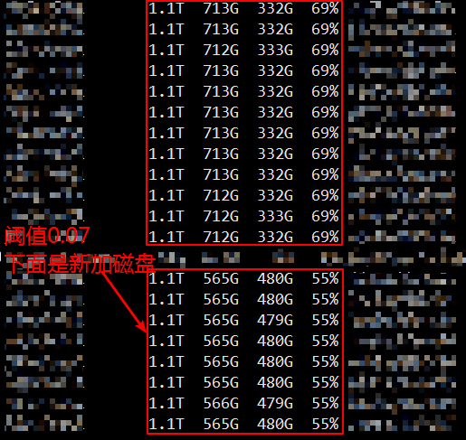

## Hadoop3.0以下版本DataNode磁盘间数据平衡器

---

项目包含两个脚本，其中 `org.apache.hadoop.hdfs.server.datanode.VolumeBalancerNew` 用于Hadoop2.6及以上版本的DN自身磁盘间数据平衡，`org.apache.hadoop.hdfs.server.datanode.VolumeBalancer` 则用于Hadoop2.6以下版本的DN磁盘间数据平衡。对于Hadoop3.0，可以直接使用 `hdfs diskbalancer` 来执行平衡

### 关于磁盘数据平衡

当现有HDFS遇到存储空间瓶颈时，我们可以通过往DN上加磁盘来缓解，而由于DN上的原有磁盘数据快满，新加的磁盘又是空的，就导致磁盘间的数据不平衡。在Hadoop3.0以下版本里，并没有提供disk-balancer工具，虽然我们可以通过设置新增数据的磁盘选择策略(参数 `dfs.datanode.fsdataset.volume.choosing.policy`)为 `org.apache.hadoop.hdfs.server.datanode.fsdataset.AvailableSpaceVolumeChoosingPolicy`，这样新来数据会尽量往空闲磁盘上写，但是它需要一个长时间的过程才能达到平衡。而不平衡带来的影响就是，数据读取会比较集中在已满的磁盘上，导致这些磁盘超负荷工作，同时也影响跑任务

### 使用方式

编译好jar之后，拷贝到需要做数据平衡的DN上，停掉该DN然后执行下面命令

> ```shell
> hadoop jar /path/to/volume-balancer-<version>.jar org.apache.hadoop.hdfs.server.datanode.VolumeBalancerNew [-threshold=0.1] [-concurrency=1] [-dirs=128]
> ```

当数据少的磁盘的可用比与整个DN的磁盘可用比达到设置的阈值范围时，或当迁移的子目录数达到 `volumes * dirs * 256` 时(volumes是DN挂载的HDFS磁盘个数)，数据平衡会自动停止

当数据平衡结束，重新启动DN即可

### 对于CDH

对于CDH而言，HDFS的配置分为静态和动态两部分，静态的位于 `/etc/conf/hadoop`，动态的位于 `/{Cloudera_Install_Path}/run/cloudera-scm-agent/process/*-hdfs-DATANODE` 下，而磁盘配置(参数 `dfs.datanode.data.dir`)的文件则位于动态目录下，所以执行脚本的时候需要加载该目录下的 `hdfs-site.xml` 或 `hdfs-site-refreshable.xml`，对于CDH，可见 使用*src/main/scripts* 下的帮助脚本

### 参数

#### threshold

默认值为 0.1，设置磁盘平衡的阈值，该值越小，磁盘越平衡，花的时间越长

#### concurrency

默认值为 1，设置数据平衡脚本的并行度，在需要平衡的磁盘比较多时，可适当调大这个值，但并不是越大越好，磁盘数据吞吐是有阈值的，建议值为2~5

#### dirs

默认值为 128，设置最大转移的子目录数，从Hadoop2.6开始HDFS采用两级子目录的结构，单个磁盘上最大文件夹个数为 256 * 256，这个值可以设置总的最大转移子目录数为 volumes * dirs * 256

### 关于项目

此项目fork自bperroud的 [volumn-balancer](https://github.com/killerwhile/volume-balancer.git)，由于原项目只提供了Hadoop2.6以下版本的DN磁盘平衡 `VolumeBalancer`，在此基础上我增加了Hadoop2.6及以上版本的磁盘平衡 `VolumeBalancerNew`，目前在生产环境使用良好，原磁盘使用率92%，平衡后69%，如下



本项目包含了原项目的脚本，但是Readme做了改动，如果是Hadoop2.6以下版本，请直接查看原项目的 [Readme](https://github.com/killerwhile/volume-balancer/blob/master/README.md)

欢迎所有人贡献您的想法、完善文档、代码、补丁、bug或其他特性，助力项目更加完善可靠！